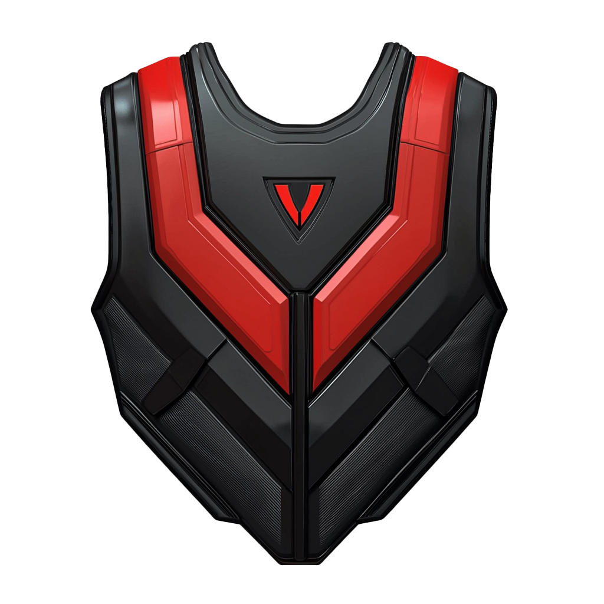

# bHaptics AIMLAB Integration

[](https://www.python.org/downloads/)
[](LICENSE)
[](https://www.bhaptics.com/develop)
[](https://github.com/nikku/works-on-my-machine)


This project provides Python scripts for controlling bHaptics haptic feedback devices locally, specifically designed for integration at AIMLAB. The implementation allows direct motor control and pattern playback without using the Official bHaptics API.




## Author

**Pi Ko**
- Email: pi.ko@nyu.edu

## Features

- **Direct Motor Control**: Precise control over individual motors in the vest
  - Funnelling effect using x,y coordinates
  - Discrete motor activation using indices
  - Intensity control (0-100)
  - Duration control (milliseconds)

- **Pattern Playback**: Support for pre-designed haptic patterns
  - Load and play `.tact` pattern files
  - Synchronized front and back panel activation
  - Multiple pattern support

- **Matrix Control Interface**: Intuitive array-based control
  - Visual pattern definition matching physical layout
  - Support for complex activation sequences
  - Built-in example patterns (wave, alternating)

## Project Structure

```
bHaptics-AIMLAB/
├── haptics_pattern_player.py    # Pattern playback from .tact files
├── haptics_motor_control.py     # Direct motor control interface
├── array_example.py            # Matrix-based pattern examples
├── AIMlab_Haptics_Jacket_Patterns.tact  # Pre-designed patterns
├── bhaptics/                  # bHaptics SDK library (do not modify)
└── requirements.txt           # Python dependencies
```

## Motor Layout

Each vest panel (front/back) has 20 motors arranged in a 4x5 grid:
```
[0]  [1]  [2]  [3]
[4]  [5]  [6]  [7]
[8]  [9]  [10] [11]
[12] [13] [14] [15]
[16] [17] [18] [19]
```
- Reading order: Left to right, top to bottom
- Identical layout for both front and back panels
- Total motors: 40 (20 front + 20 back)

## Requirements

- Python 3.7 or higher
- bHaptics Player software installed and running
- Compatible bHaptics haptic devices
- Windows 10/11 operating system

## Dependencies

```bash
websocket-client~=0.57.0
python-osc~=1.7.4
keyboard~=0.13.5
```

## Installation

1. Clone the repository:
   ```bash
   git clone https://github.com/yourusername/bHaptics-AIMLAB.git
   cd bHaptics-AIMLAB
   ```

2. Install the required dependencies:
   ```bash
   pip install -r requirements.txt
   ```

3. 🚨⚠️ Ensure bHaptics Player is running on your system
4. 🚨⚠️ IMPORTANT: Ensure your bHaptics Player is not in Feedback Test Mode
5. Connect your bHaptics device

## Usage

### 1. Direct Motor Control (`haptics_motor_control.py`)

Two methods are available for controlling individual motors:

#### Funnelling Effect Control
```python
from haptics_motor_control import activate_funnelling

# Activate nearest motor to coordinates
activate_funnelling(
    panel='front',      # 'front' or 'back'
    x=0.5,             # 0.0 (left) to 1.0 (right)
    y=0.5,             # 0.0 (bottom) to 1.0 (top)
    intensity=100,      # 0 to 100
    duration_ms=1000    # milliseconds
)
```

#### Discrete Motor Control
```python
from haptics_motor_control import activate_discrete

# Activate specific motor by index
activate_discrete(
    panel='back',       # 'front' or 'back'
    motor_index=0,      # 0 to 19
    intensity=100,      # 0 to 100
    duration_ms=1000    # milliseconds
)
```

### 2. Matrix Pattern Control (`array_example.py`)

Create and play patterns using intuitive matrix representation:

```python
pattern_step = {
    "front": [
        [100, 100, 100, 100],  # Row 1
        [0, 0, 0, 0],          # Row 2
        [0, 0, 0, 0],          # Row 3
        [0, 0, 0, 0],          # Row 4
        [0, 0, 0, 0]           # Row 5
    ],
    "back": [
        [50, 50, 50, 50],      # Row 1
        [0, 0, 0, 0],          # Row 2
        [0, 0, 0, 0],          # Row 3
        [0, 0, 0, 0],          # Row 4
        [0, 0, 0, 0]           # Row 5
    ]
}

# Activate the pattern
activate_motor_array(pattern_step, duration_ms=500)
```

### 3. Pattern Playback (`haptics_pattern_player.py`)

Play pre-designed `.tact` patterns:

```python
from haptics_pattern_player import play_pattern

# Play a .tact file pattern
play_pattern("AIMlab_Haptics_Jacket_Patterns.tact")
```

## Testing

Run the example patterns:
```bash
python array_example.py
```

This will demonstrate:
1. Wave pattern (top to bottom)
2. Alternating pattern (front/back activation)

## Contributing

1. Fork the repository
2. Create your feature branch (`git checkout -b feature/amazing-feature`)
3. Commit your changes (`git commit -m 'Add amazing feature'`)
4. Push to the branch (`git push origin feature/amazing-feature`)
5. Open a Pull Request

## License

This project is licensed under the MIT License - see the [LICENSE](LICENSE) file for details.


## Contact

For questions or support, please contact:
- Pi Ko - pi.ko@nyu.edu
- AIMLAB - [Lab Website](https://aimlab-haptics.com/)

